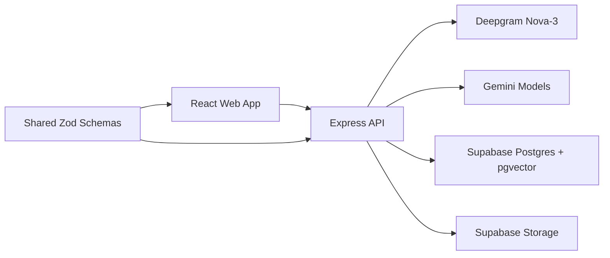
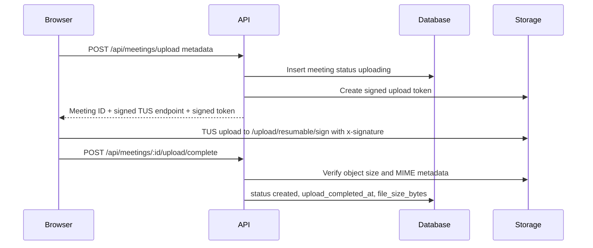
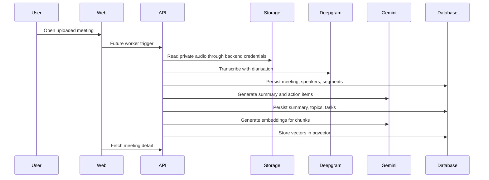
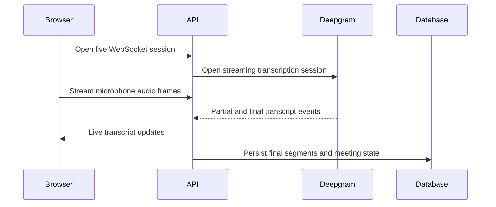

# ScribeFlow Architecture

## System Overview

ScribeFlow is an npm-workspaces monorepo with three TypeScript packages:

- `apps/web`: React, Vite, Tailwind, React Router and TanStack Query.
- `apps/api`: Express API, request validation, security middleware and future provider boundaries.
- `packages/shared`: Zod schemas and TypeScript domain types shared by frontend and backend.

The backend is the only process allowed to communicate with Deepgram, Gemini and Supabase backend credentials. The frontend only talks to ScribeFlow API endpoints and receives short-lived upload instructions for private Supabase Storage.



## Component Boundaries

- Web app: presentation, form state, route state and friendly API errors.
- API controllers: HTTP request validation and response shaping.
- Services: provider-facing business boundaries.
- Repositories: database access and deterministic analytics queries.
- Storage service: signed resumable upload tokens, object metadata checks, cleanup and future signed read URLs.
- Shared package: transport-safe schemas and inferred types.

## Phase 2 Uploaded Meeting Data Flow

```text
Browser
  -> API creates meeting and signed upload token
  -> Browser uploads directly to private Supabase Storage with TUS
  -> Browser notifies API
  -> API verifies object metadata
  -> API marks meeting ready
```

Audio bytes do not pass through Express in Phase 2. Direct browser-to-Supabase TUS upload gives genuine byte progress, supports resumable transfer, avoids buffering large files in the Node process and still keeps authorization server-controlled through short-lived signed upload tokens. The browser never receives the Supabase secret key.



## Cloud Verification Flow

The opt-in `npm run verify:supabase-cloud` script exercises the same Phase 2
boundaries against a real running API and Supabase project:

```text
Browser/API verifier
  -> API creates meeting
  -> API creates signed upload token
  -> TUS client uploads to private Supabase Storage
  -> API verifies storage metadata
  -> API marks meeting created
  -> list/detail APIs return persisted data
```

The script is intentionally API-side because it also checks private storage with
a backend key. It keeps signed upload tokens and signed download URLs in memory
only and prints safe evidence such as HTTP status codes, meeting ID, object path
and byte counts.

Supabase has two resumable upload authorization modes:

```text
User-authenticated TUS:
  /storage/v1/upload/resumable
  Authorization: Bearer <user access token>

Signed TUS:
  /storage/v1/upload/resumable/sign
  x-signature: <signed upload token>
```

ScribeFlow uses the signed TUS endpoint in Phase 2. The browser receives only a
short-lived path-scoped token and never receives the Supabase server secret.
The cloud verifier has confirmed signed upload, private public-access rejection,
signed server-authorized retrieval, and persisted meeting list/detail reads.

## Planned AI Data Flow After Upload



## Planned Live Meeting Data Flow



## Transcription and Diarisation Strategy

- Use Deepgram Nova-3 for speech-to-text.
- Enable Deepgram speaker diarisation so transcript words include speaker labels.
- Normalize provider output into `transcript_segments`.
- Preserve word timing metadata where available.
- Create `meeting_speakers` from raw diarisation labels.
- Allow users to rename display names without mutating raw speaker indexes.

## Summary and Action-Extraction Strategy

- Use Gemini structured output with a strict schema matching `MeetingSummary` and `ActionItem`.
- Include transcript timestamps in prompts so extracted tasks can cite evidence.
- Reject malformed model output rather than silently falling back to mock data.
- Keep confidence scores and evidence text so users can review uncertain items.

## RAG Indexing and Retrieval Strategy

- Chunk transcripts by time window, speaker turn and semantic boundaries.
- Store chunk text, timestamps, speaker references and metadata.
- Generate Gemini embeddings with centrally configured model names.
- Store vectors in Supabase Postgres with pgvector.
- Search uses vector similarity plus metadata filters, then returns source-grounded results.

Transcript chunking is needed because full meeting transcripts can exceed model context windows and because search results must point to specific source spans.

## Analytics Computation Strategy

Speaking time, participant count, action item count, completion rate and topic counts should be deterministic database calculations. An LLM should not estimate these values because the source records already contain exact timestamps and statuses. Deterministic calculations are reproducible, debuggable and easier to explain in a viva.

## Security Boundaries

- No provider keys in frontend code.
- Only `VITE_API_BASE_URL` is exposed to the browser.
- Server secrets are loaded from environment variables.
- Health checks report only boolean configuration flags.
- `SUPABASE_SECRET_KEY` is preferred; `SUPABASE_SERVICE_ROLE_KEY` is a legacy fallback.
- Supabase backend-key access stays in the API.
- RLS is enabled on all application tables with no `anon` or `authenticated` policies in Phase 2.
- The `meeting-audio` bucket is private and has no anonymous storage policies.
- Pino redacts authorization headers, `x-signature` values and signed upload tokens.
- Future authentication can be added at the API boundary without changing provider boundaries.

## Error Handling

- Incoming payloads are validated with Zod.
- API errors use:

```json
{
  "error": {
    "code": "FEATURE_NOT_IMPLEMENTED",
    "message": "Meeting transcription is not connected yet.",
    "requestId": "..."
  }
}
```

- Production provider failures must return explicit user-facing errors.
- Silent mock fallbacks are forbidden.
- Request IDs are included in all API errors.

## Future Deployment Shape

- Static web app hosted on Vercel, Netlify or Supabase hosting.
- Node API hosted on a server platform that supports file upload and WebSockets.
- Supabase Postgres, pgvector and Storage for persistence.
- Environment variables managed by deployment platform secrets.
- Background workers can be split from the API when processing grows.
